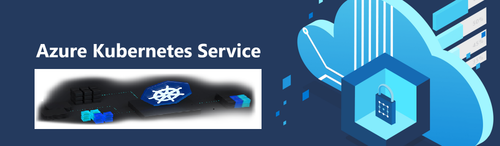

&emsp;
&emsp;

# 云原生应用Devhack2023

Fabrikam医疗会议提供会议网站服务，专为医疗界量身定做。他们的业务已经增长，许多情况下的代码基础和每个租户的变化周期的管理已经失控。

本研讨会的目标是帮助他们建立一个概念验证 （POC），将他们的代码迁移到一个更易于管理的过程，包括租户代码的容器化、更好的 DevOps 工作流程以及数据库后端的简单提升和移位故事。

2023 年 1 月

## 目标受众

-   应用程序开发人员
-   基础设施架构师

## 云原生Devhack概览

### Workshop

在这个研讨会上，您将构建一个概念证明 （POC），将现有的本地应用程序转变为基于容器的应用程序。此 POC 将提供利用 Azure Kubernetes 服务 （AKS）、Linux Node上的 Docker 容器以及从Mongo开发银行迁移到 Cosmos 开发银行的多租户 Web 应用托管解决方案。

在这个研讨会结束时，您将能够通过经过时间测试的 DevOps 实践，更好地提高基于容器的应用程序的可靠性和增加释放节奏。

### 白板设计章节

在此白板设计会话中，您将了解与在 Azure 中构建和部署容器化应用程序相关的选择、围绕此做出的关键决策以及解决方案的其他方面，包括如何提升和转移应用程序的部件以减少应用程序更改。

到本设计会议结束时，您将能够更好地设计针对 Azure Kubernetes 服务 （AKS） 的解决方案，并为容器化应用程序定义 DevOps 工作流程。

## 动手实验

这个动手实验旨在引导您完成构建和部署 Docker 镜像到 Azure Kubernetes 服务 （AKS） 托管的 Kubernetes 平台的过程，此外还学习如何处理动态服务发现、服务扩展和高可用性。

在此实验结束时，您将能够更好地构建和部署容器化应用程序到 Azure Kubernetes 服务，并执行常见的 DevOps 程序。

  &emsp;

- [云原生应用 -动手实验前的准备](./Azure-Cloud-native-Devhack2023/Hands-on%20lab/%E4%BA%91%E5%8E%9F%E7%94%9F%E5%BA%94%E7%94%A8%20-%E5%8A%A8%E6%89%8B%E5%AE%9E%E9%AA%8C%E5%89%8D%E7%9A%84%E5%87%86%E5%A4%87.md)
  
- [云原生应用 -开发者版本实验](./Azure-Cloud-native-Devhack2023/Hands-on%20lab/%E4%BA%91%E5%8E%9F%E7%94%9F%E5%BA%94%E7%94%A8%20-%E5%BC%80%E5%8F%91%E8%80%85%E7%89%88%E6%9C%AC%E5%AE%9E%E9%AA%8C.md)
  * <a href="./Azure-Cloud-native-Devhack2023/Hands-on%20lab/%E4%BA%91%E5%8E%9F%E7%94%9F%E5%BA%94%E7%94%A8%20-%E5%BC%80%E5%8F%91%E8%80%85%E7%89%88%E6%9C%AC%E5%AE%9E%E9%AA%8C.md#exercise-1-create-and-run-a-docker-application">练习1：创建并运行Docker应用程序</a>
  * <a href="./Azure-Cloud-native-Devhack2023/Hands-on%20lab/%E4%BA%91%E5%8E%9F%E7%94%9F%E5%BA%94%E7%94%A8%20-%E5%BC%80%E5%8F%91%E8%80%85%E7%89%88%E6%9C%AC%E5%AE%9E%E9%AA%8C.md#exercise-2-migrate-mongodb-to-cosmos-db-using-azure-database-migration-service">练习2：使用Azure数据库迁移服务将MongoDB迁移到Cosmos DB</a>
  * <a href="./Azure-Cloud-native-Devhack2023/Hands-on%20lab/%E4%BA%91%E5%8E%9F%E7%94%9F%E5%BA%94%E7%94%A8%20-%E5%BC%80%E5%8F%91%E8%80%85%E7%89%88%E6%9C%AC%E5%AE%9E%E9%AA%8C.md#exercise-3-deploy-the-solution-to-azure-kubernetes-service">练习3：将解决方案部署到Azure Kubernetes服务</a>
  * <a href="./Azure-Cloud-native-Devhack2023/Hands-on%20lab/%E4%BA%91%E5%8E%9F%E7%94%9F%E5%BA%94%E7%94%A8%20-%E5%BC%80%E5%8F%91%E8%80%85%E7%89%88%E6%9C%AC%E5%AE%9E%E9%AA%8C.md#exercise-4-scale-the-application-and-test-ha">练习4：扩展应用程序并测试HA</a>
  * <a href="./Azure-Cloud-native-Devhack2023/Hands-on%20lab/%E4%BA%91%E5%8E%9F%E7%94%9F%E5%BA%94%E7%94%A8%20-%E5%BC%80%E5%8F%91%E8%80%85%E7%89%88%E6%9C%AC%E5%AE%9E%E9%AA%8C.md#exercise-5-working-with-services-and-routing-application-traffic">练习5：使用服务和路由应用程序流量</a>
  
- [白板设计](MCW-Cloud-native-applications/Whiteboard%20design%20session)
  * [学生指南](./Azure-Cloud-native-Devhack2023/Whiteboard%20design%20session/%E7%99%BD%E6%9D%BF%E8%AE%BE%E8%AE%A1%E5%AD%A6%E7%94%9F%E6%8C%87%E5%8D%97.md)
  * [讲师指南](./Azure-Cloud-native-Devhack2023/Whiteboard%20design%20session/%E7%99%BD%E6%9D%BF%E8%AE%BE%E8%AE%A1%E8%AE%B2%E5%B8%88%E6%8C%87%E5%8D%97.md)	
  * [讲师胶片](./Azure-Cloud-native-Devhack2023/Whiteboard%20design%20session/%E7%99%BD%E6%9D%BF%E8%AE%BE%E8%AE%A1%E8%AE%B2%E5%B8%88presentation.pptx)	
  &emsp;
  &emsp;
-  Azure服务及动手实验涉及第三方相关服务
     *   Azure Kubernetes Service （AKS）
     *   Azure容器注册表(ACR)
     *   GitHub或Gitee
     *   Dockerfile
     *   Cosmos DB数据库（包括MongoDB API）

  &emsp;
  &emsp;

## Azure解决方案

应用现代化

## 相关参考文献

-   [MCW](https://github.com/Microsoft/MCW)

## 帮助和支持

我们欢迎微软合作伙伴反馈和评论。

**_有麻烦吗？_**

-   首先，验证您是否遵循了所有书面的实验说明（包括实际操作前的实验文档）。
-   接下来，提交问题并详细说明问题。
-   不要提交拉取请求。我们的内容作者将进行所有更改并提交拉力请求以供批准。

## Azure订阅获取

Azure海外使用账号申请可以参考[链接](http://www.cnblogs.com/meowmeow/p/7773226.html?from=groupmessage&isappinstalled=0)
